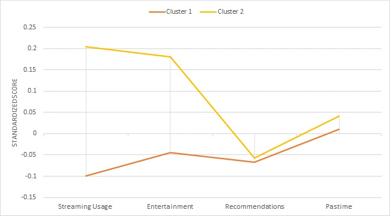

<br>

# Importing the data set
- The data set has been cleaned prior to importing; further data preparation can be included.


<br>

# 1. Data Preparation 
- Further data preparation.
- Catergorisation of variables into segmentation bases and descriptors.

```r
disney1 <-  disney %>%  
  filter(Age < 24) %>%  #filter for young consumer segment: <24 years old 
  mutate("Nationality_4_TEXT" = NULL) #remove respondent.ID(unnecessary), nationality_4_text columns(too many missing values)
head(disney1)
```

```
##   Respondent.ID Gender Age Nationality Living HHSize StreamingUsage Device
## 1             1      1  17           2      1      5              5      4
## 2             2      2  17           2      3      1              5      3
## 3             3      1  19           4      2     16              1      1
## 4             4      2  17           3      1      5              2      4
## 5             5      2  18           3      1      4              3      1
## 6             6      1  18           2      1      6              4      1
##   UnaidedbrandrecallDisney WTP Pastime Entertainment Recommendation ZStreamingUsage
## 1                        0  15       4           6.0           3.50         1.50446
## 2                        1  20       5           5.0           4.50         1.50446
## 3                        0  20       2           5.5           4.00        -1.23897
## 4                        0  30       3           5.5           4.50        -0.55311
## 5                        0  15       6           6.5           5.25         0.13275
## 6                        0  25       4           7.0           4.00         0.81860
##   ZEntertainment ZRecommendation   ZPastime
## 1     -1.2385096     -0.37750756  0.1604940
## 2      0.6937862      0.49366374  0.8086429
## 3      0.6937862      0.05807809 -1.1358037
## 4      0.8870158      0.49366374 -0.4876549
## 5     -1.2385096      1.14704221  1.4567917
## 6      1.4667046      0.05807809  0.1604940
```

```r
#Base
base <- matrix(disney1$WTP, nrow = 94, ncol=1)
basis = disney1 %>%select(WTP)
descriptors = disney1 %>% select(-WTP, -StreamingUsage, -Recommendation, -Pastime, -Entertainment )
```
<br>
Application of k-means clustering to form relevant segments in the data using consumers’ WTP (in €) as the basis for segmentation.
<br>

```r
#make this example reproducible
set.seed(1)

#perform k-means clustering with k = 2 clusters
kmbasis <- kmeans(basis, centers = 2, nstart = 25) #means that R will try 25 different random starting assignments and then select the best results
kmbasis
```

```
## K-means clustering with 2 clusters of sizes 56, 38
## 
## Cluster means:
##         WTP
## 1  7.874821
## 2 18.894211
## 
## Clustering vector:
##  [1] 2 2 2 2 2 2 2 2 2 2 2 2 2 2 2 2 2 2 2 2 2 2 2 2 2 2 2 2 2 2 2 2 2 2 2 2 2 2 1 1 1
## [42] 1 1 1 1 1 1 1 1 1 1 1 1 1 1 1 1 1 1 1 1 1 1 1 1 1 1 1 1 1 1 1 1 1 1 1 1 1 1 1 1 1
## [83] 1 1 1 1 1 1 1 1 1 1 1 1
## 
## Within cluster sum of squares by cluster:
## [1] 860.0826 975.7349
##  (between_SS / total_SS =  60.0 %)
## 
## Available components:
## 
## [1] "cluster"      "centers"      "totss"        "withinss"     "tot.withinss"
## [6] "betweenss"    "size"         "iter"         "ifault"
```

```r
kmbasis$cluster
```

```
##  [1] 2 2 2 2 2 2 2 2 2 2 2 2 2 2 2 2 2 2 2 2 2 2 2 2 2 2 2 2 2 2 2 2 2 2 2 2 2 2 1 1 1
## [42] 1 1 1 1 1 1 1 1 1 1 1 1 1 1 1 1 1 1 1 1 1 1 1 1 1 1 1 1 1 1 1 1 1 1 1 1 1 1 1 1 1
## [83] 1 1 1 1 1 1 1 1 1 1 1 1
```

```r
kmeans <- as.factor(kmbasis$cluster)
kmeans
```

```
##  [1] 2 2 2 2 2 2 2 2 2 2 2 2 2 2 2 2 2 2 2 2 2 2 2 2 2 2 2 2 2 2 2 2 2 2 2 2 2 2 1 1 1
## [42] 1 1 1 1 1 1 1 1 1 1 1 1 1 1 1 1 1 1 1 1 1 1 1 1 1 1 1 1 1 1 1 1 1 1 1 1 1 1 1 1 1
## [83] 1 1 1 1 1 1 1 1 1 1 1 1
## Levels: 1 2
```
**Results:** 

- Clusters contain 56 and 38 observations respectively. 
- Cluster 1 has an average WTP (in €) of 7.87(3sf) while Cluster 2 has an average of 18.9(3sf).
- Clusters have a compactness(similarity) of 60%.


<br>


# 2. Validating Cluster Partitions
- Use of appropriate hypothesis test to check whether the two resulting clusters significantly differ in terms of their WTP (in €). 
- Also, the average WTP (in €) for each cluster is shown.
<br>

```r
#Mean for WTP cluster 1:
cluster1 <- basis %>% filter(kmeans == 1)
mean(cluster1$WTP) #mean = 7.874821
```

```
## [1] 7.874821
```

```r
#Mean for WTP cluster 2:
cluster2 <- basis %>% filter(kmeans == 2)
mean(cluster2$WTP) #mean = 18.89421
```

```
## [1] 18.89421
```

```r
#T-test for differences in mean (WTP):

#Creation of T-test function
ttest <- function(training, testing) {
  x1_mean <- mean(testing)
  x2_mean <- mean(training)
  s1 <- sd(testing)
  s2 <- sd(training)
  n1 <- length(testing)
  n2 <- length(training)
  dfs <- min(n1-1, n2-1)
  tdata <- (x1_mean - x2_mean) / sqrt((s1^2/n1)+(s2^2/n2))
  tdata
  pvalue <- 2*pt(abs(tdata), df = dfs, lower.tail = FALSE)
  return(pvalue)
}

ttest(training = cluster1$WTP, testing = cluster2$WTP) #t-test result: p-value of 2.066837e-13
```

```
## [1] 2.066837e-13
```
**Results:** 

- The average WTP (in €) for ClusterS 1 and 2 are 7.87(3sf) and 18.9(3sf) respectively. 
- Since the p-value of the t-statistic is much smaller than the 5% or 10% significance level, it implies that there is a statistically significant differences in the means of the clusters. Normality can be assumed as the data set is small.

<br>


# 3. Analysis 
Analysis for significant differences in the demographic variables (i.e., gender, nationality, household size) and the device they predominately use for online streaming between the two clusters.
<br>

```r
#Since all the demographic variables are numerical, the t-test will be used.
#List of demographic variables: gender, age, nationality, living, HHsize

cluster1d = descriptors[which(kmbasis$cluster == 1),] #split descriptors into 2 clusters
cluster2d = descriptors[which(kmbasis$cluster == 2),]

#Hypothesis test for Gender:
x1 <- sum(cluster1d$Gender == 1)
x2 <- sum(cluster2d$Gender == 1)
n1 <- length(cluster1d$Gender)
n2 <- length(cluster2d$Gender)
p1 <- x1 / n1
p2 <- x2 / n2
ppooled <- (x1+x2) / (n1+n2)
zdata <- (p1-p2) / sqrt(ppooled*(1-ppooled)*((1/n1)+(1/n2)))
pvalue <- 2*pnorm(abs(zdata), lower.tail = FALSE)
pvalue
```

```
## [1] 0.1499454
```

```r
#Hypothesis test for Age:
ttest(training = cluster1d$Age, testing = cluster2d$Age)
```

```
## [1] 1.835906e-05
```

```r
#Hypothesis test for Nationality:
freq1_1 <- sum(cluster1d$Nationality == 1)
freq1_2 <- sum(cluster1d$Nationality == 2)
freq1_3 <- sum(cluster1d$Nationality == 3)
freq1_4 <- sum(cluster1d$Nationality == 4)

freq2_1 <- sum(cluster2d$Nationality == 1)
freq2_2 <- sum(cluster2d$Nationality == 2)
freq2_3 <- sum(cluster2d$Nationality == 3)
freq2_4 <- sum(cluster2d$Nationality == 4)
freq_table <- as.table(rbind(c(freq1_1, freq1_2, freq1_3, freq1_4),
                             c(freq2_1, freq2_2, freq2_3, freq2_4)))
dimnames(freq_table) <- list(
Data.Set = c("Cluster 1", "Cluster 2"),
Status = c("Dutch", "German", "Belgian", "Other"))
freq_table
```

```
##            Status
## Data.Set    Dutch German Belgian Other
##   Cluster 1     4     23       7    22
##   Cluster 2     0     16       8    14
```

```r
Xsq_data <- chisq.test(freq_table)
Xsq_data$statistic
```

```
## X-squared 
##  3.793133
```

```r
Xsq_data$p.value
```

```
## [1] 0.2846858
```

```r
#Hypothesis test for Living:
ttest(training = cluster1d$Living, testing = cluster2d$Living)
```

```
## [1] 0.5991855
```

```r
#Hypothesis test for HHsize:
ttest(training = cluster1d$HHSize, testing = cluster2d$HHSize)
```

```
## [1] 0.04665731
```

```r
#Since Device is a nominal variable, the Chi-squared test will be used.
freq1_1 <- sum(cluster1d$Device == 1)
freq1_2 <- sum(cluster1d$Device == 2)
freq1_3 <- sum(cluster1d$Device == 3)
freq1_4 <- sum(cluster1d$Device == 4)

freq2_1 <- sum(cluster2d$Device == 1)
freq2_2 <- sum(cluster2d$Device == 2)
freq2_3 <- sum(cluster2d$Device == 3)
freq2_4 <- sum(cluster2d$Device == 4)
freq_table <- as.table(rbind(c(freq1_1, freq1_2, freq1_3, freq1_4),
                             c(freq2_1, freq2_2, freq2_3, freq2_4)))
dimnames(freq_table) <- list(
Data.Set = c("Cluster 1", "Cluster 2"),
Status = c("Laptop", "PC", "Tablet", "Phone"))
freq_table
```

```
##            Status
## Data.Set    Laptop PC Tablet Phone
##   Cluster 1     33  4      4    15
##   Cluster 2     14  2     10    12
```

```r
Xsq_data <- chisq.test(freq_table)

Xsq_data$statistic
```

```
## X-squared 
##  8.102578
```

```r
Xsq_data$p.value
```

```
## [1] 0.04393862
```
**Results:** 

- The hypothesis tests were supposed to determine whether the difference between the two clusters are significant. Based on these p-values, we can see that the results are mixed.
- Variables Age, HHSize and Device show p-values below the 0.10 significance level, so we can conclude that there there are significant differences between the two clusters.
- Variables Living, Gender and Nationality do not provide enough evidence to say that there are significant differences between the two segments.


<br>

# 4. Data Visualisation 

- Creation of a profile of both clusters (“snake chart”) using the variables from the data set which represent some of consumers’ needs with respect to online streaming services, i.e., streaming usage, entertainment, recommendations, pastime (hint: please make use of the standardized variables to create the cluster profiles). 
- Analysis of variables where differences are found. For this/these variable(s), the appropriate hypothesis test(s) are conducted to check if this/these difference(s) is/are statistically different (the original values of the variable(s) are used for hypothesis testing).
- Variables from the data set which represent some of consumers' needs with respect to online streaming services: ZStreamingUsage, ZEntertainment, ZRecommendation, ZPastime
<br>
<!-- -->
<br>
<br>
**Results:** 
The most notable results are that clusters 1 and 2 differ the most when it comes to Streaming usage. The 2nd greatest difference in standardised scores is in Entertainment. Conversely, both clusters score very similarly for Recommendations, and displayed a moderate difference when it came to Pastime.


Interpretation of the Snake Chart:

- Despite being around the same age (17-23 years old), the respondents seem to have very different attitudes and priorities when it comes to streaming videos.
- Cluster 1: High standardised scores in both Streaming Usage and Entertainment indicate that respondents spend a lot of time streaming videos online, they do not stream for Entertainment. It could be that they use it for more pragmatic reasons such as supplementing their education, since most would still be schooling. 
- Cluster 2: Low standardised scores in both Streaming Usage and Entertainment indicate that respondents generally do not spend a lot of hours (daily) watching videos via streaming services, but when they do, they do it for entertainment.
- Both clusters are receptive and responsive to recommendations for videos from online streaming services.
- Both clusters generally disagree that they consume online videos to pass the time. This finding also indicates that Cluster 1 is more consistent since it has high standardised scores for Entertainment.


<br>

```r
#Hypothesis tests
ttest(training = cluster1d$ZStreamingUsage, testing = cluster2d$ZStreamingUsage)
```

```
## [1] 0.1577568
```

```r
ttest(training = cluster1d$ZEntertainment, testing = cluster2d$ZEntertainment)
```

```
## [1] 0.3048904
```

```r
ttest(training = cluster1d$ZRecommendation, testing = cluster2d$ZRecommendation)
```

```
## [1] 0.9609302
```

```r
ttest(training = cluster1d$ZPastime, testing = cluster2d$ZPastime)
```

```
## [1] 0.8829256
```
<br>
**Results:** All variables used have p-values that are much larger than the 5% or 10% significance levels. This implies that none of the clusters have statistically significant different means.
<br><br>


# 5. Conclusion
Meaningful insights for Disney+. 
<br>
<br>
**Insights:** 
<br>

- The striking differences in Streaming usage indicate that respondents allocate very disparate number of hours daily to watching online videos. This is interesting for marketers to note, because despite being around the same age(17-23 years old), the respondents seem to have very different attitudes and priorities when it comes to streaming videos for entertainment. Disney would also have to be extra mindful when selecting marketing techniques as techniques like mass marketing which would be disadvantageous.  

- The great difference in Entertainment correspond to the resulting scores for Streaming usage. Respondents in cluster 1 seem to have a strong aversion to streaming videos for entertainment. On the other hand, respondents from cluster 2 display a moderate inclination to steaming online videos for entertainment.

- Similar scores between both clusters for Recommendations indicate that youths(at least in this sample) are not easily influenced by the recommendations offered by online streaming services. For marketers, this could correlate to ineffectuality if they were to market products via online streaming platforms. This could also hint that Disney should focus their marketing efforts on other platforms.

- Lastly, both clusters have moderate scores between 0 and 0.5. This indicates that respondents from both clusters generally do not consume online videos as a way to pass their time. This finding supports findings from Recommendations' scores. 

Overall, it seems that these youths do not enjoy streaming online videos for entertainment and are also not easily swayed by recommendations offered via 3rd party streaming services. For Disney to appeal to this niche market, it would be wise to conduct more intensive research into youth's behavioural and psychographic characteristics.

<br>
**Characterisation:**
<br>
Cluster 1 - Respondents are generally more pragmatic and cautious about how they consume online streaming services. 

Cluster 2 - Repondents are generally more receptive, open-minded, . They could also be more creative, playful youths since one would have to be rather imaginative to enjoy Disney's productions. 

<br>
**Marketing Suggestions:**

- Recommended target group: Cluster 2
  - They are the ideal market segment for Disney since they prefer to stream videos for entertainment. There is a lot of potential for Disney to gain a foothold in the online streaming industry, if they can encourage relatively hedonistic respondents to stream Disney productions, and to stream Disney videos more frequently.

- Focus on Differentiated Marketing. 
  - Benefit of Differentiated Marketing: Disney can hope for higher sales and a stronger position when catering to different clusters.
  - Cost of Differentiated Marketing: Disney could incur higher costs eg for extra marketing research, forecasting, sales analysis, promotion planning and channel management. 

- A possible strategy Disney could capitalise on is to appeal to millennials' nostalgia since many millennials would have watched Disney productions growing up. 

- Disney could also offer a More for Less proposition, as youths at this age tend to be more attracted to value-for-money entertainment since most would still be schooling rather than working.

<br>
